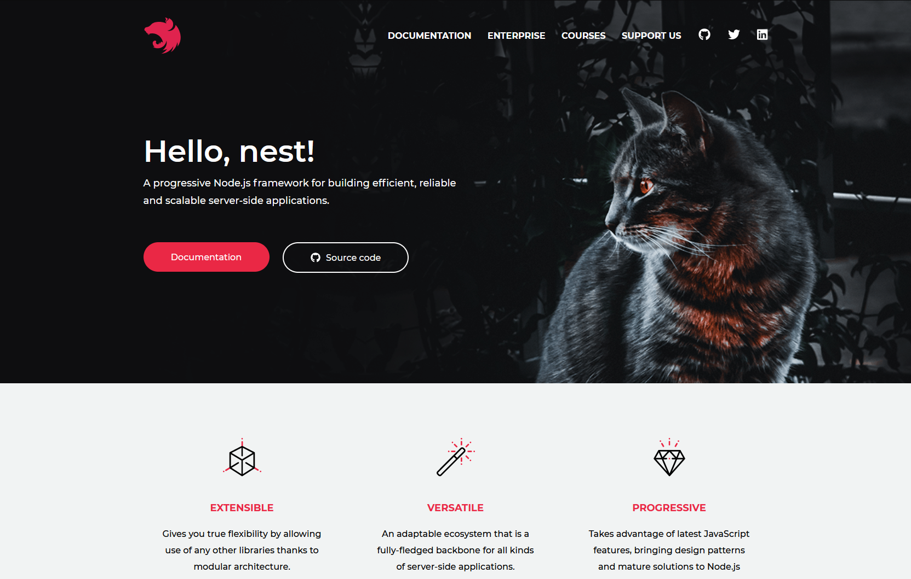

# Nest.js

## Building efficient, scalable Node.js server-side applications in Typescript with the Nest.js framework

---

# Contents

1.  Intro
2.  Features
3.  Setup
4.  Demo 1: Generate a CRUD application
5.  Walker app
6.  Demo 2: Walker app

---



---

# Intro

- **Node.js** framework
  - **Express** or **Fastify**
- Language: **Typescript**
- The architecture is heavily inspired by **Angular**.

---

# Features

- Controllers
- Providers _(ie Services)_
- MVC _(eg Handlebars template)_
- Database _(SQLite)_
- ORM _(by TypeORM)_
- Modules
- Middleware
- Pipes
- Validation
- OpenApi
- DDD

---

# Other Features

Other interesting features of Nest.js. These will not be shown during this demo.

- Security
  - OAuth, ...
- Microservices
- Queues and Task scheduling (cron)
- Websockets
- Messaging/Events integration
  - RabbitMQ, ...

---

# Setup

Install:

```
npm i -g @nestjs/cli
```

Create a new project:

```
nest new todo-project
```

Generate a CRUD endpoint with Entities DTOs, Controller, Module and Service:

```
nest g crud todo
```

---

# Walker

Like everyone during the lockdown, I started to walk more and plan a lot of trips.

Why not build and app to register those trips and rate them.

---

# Demo 2: Walker App


---

# Personal Findings

- Nice to use
- Familiar with **Angular**
- More flexible than **Angular** and less verbose than **dotnet core**
- => Good solution for **micro**services

---

# Final

- Try it out, link: https://github.com/diiode/Walker
- Can this framework be used within the organization?

---

# Notes

- Seperating TypeORM from Entities by using Schemas looks like the perfect way to DDD, but your models end up as anemic models. You can't add functions to it.
- Injecting Typescript interfaces via DI doesn't work the same way as in dotnet core. It's not as clean but it's possible:

In a module:

```
providers: [{
  provide: 'ICountryRepo',
  useClass: CountryRepo,
}]
```

In the provider itself:

```
constructor(
  @Inject('ICountryRepo')
  private countryRepository: IRepo<string, Country>,
) {}
```
